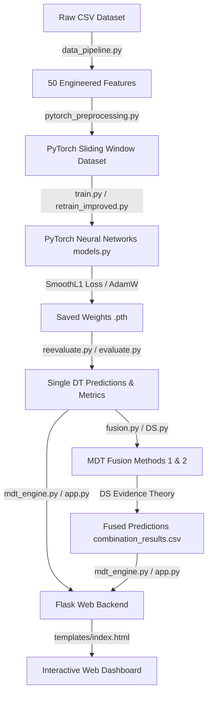

# Multi-Digital Twin (MDT) Wind Power Forecasting
*Sabarmati Riverfront Off-Grid Wind Turbine Analysis & Deep Learning Forecasting*

## Overview

This project implements **wind power forecasting** using multi-digital twin (MDT) techniques with deep learning models. The system processes hourly meteorological data from an Indian wind farm and predicts power generation using multiple highly optimized neural network architectures.

**Key Methods:**
- Single-Index Dynamic Optimization Method
- Multi-Index Dynamic Fusion Method

---

## Dataset

| Property | Value |
|----------|-------|
| **Location** | Sabarmati Riverfront, Ahmedabad (SiteID: 36565), Lat: 23.03°N, Lon: 72.56°E |
| **Year** | 2014 |
| **Records** | 8,760 hourly observations |
| **Wind Heights** | 40m, 80m, 100m, 120m |
| **Target Variable** | Wind Power (kW) |

### Wind Power Computation

Power is calculated using the cubic power curve formula:

$$P = 0.5 \times \rho \times A \times C_p \times v^3$$

| Parameter | Value |
|-----------|-------|
| Air density (ρ) | Dynamic (computed from Temp and Pressure) |
| Rotor diameter | 28 m |
| Rotor area (A) | 615.75 m² |
| Power coefficient (Cp) | 0.40 |
| Cut-in speed | 3.0 m/s |
| Cut-out speed | 25.0 m/s |
| Rated power | 250 kW |

---

## Engineered Features (50 Total)

The high-accuracy models are powered by an extensive set of engineered features:

| Category | Features | Count |
|----------|----------|-------|
| Wind Speed | wind_speed_120m/100m/80m/40m, wind_speed_80m_sq, wind_speed_80m_cb | 6 |
| Wind Direction | wind_dir_sin, wind_dir_cos | 2 |
| Wind Profile | ws_ratio_120_80, ws_ratio_80_40, wind_shear | 3 |
| Thermodynamics | temp_80m, temp_120m, temp_gradient, pressure_100m, pressure_diff, air_density | 6 |
| Power | wind_power_density | 1 |
| Temporal | hour_sin, hour_cos, month_sin, month_cos, doy_sin, doy_cos | 6 |
| Rolling Stats (3h/6h/12h/24h) | mean, std, max, min for each window | 16 |
| Turbulence | turbulence_intensity | 1 |
| Rate of Change | ws_diff_1, ws_diff_2 | 2 |
| Lags | ws_lag_1/2/3/6, wp_lag_1/2/3 | 7 |

---

## Models (V2 High-Accuracy Architecture)

All models use **PyTorch** with sequence length = 24 (full day lookback).

### Architecture Details

**LSTM:**
- Input: (batch_size, 24, 50)
- LSTM layers: 3 layers, 128 hidden units
- Regularization: Dropout(0.15), BatchNorm1d
- Dense layers: 128 → 64 → 1

**GRU:**
- Input: (batch_size, 24, 50)
- GRU layers: 3 layers, 128 hidden units
- Regularization: Dropout(0.15), BatchNorm1d
- Dense layers: 128 → 64 → 1

**LSTMCNN / GRUCNN (Hybrid):**
- CNN block: 1D Convs (64 → 32 filters, kernel_size=3)
- Attention: Custom Temporal Attention Layer (replaces average pooling)
- Recurrent: 2 layers, 128 hidden units
- Dense layers: 32 → 16 → 1

**Training Setup:**
- Optimizer: AdamW (lr=0.0005, weight_decay=1e-5)
- Scheduler: ReduceLROnPlateau (factor=0.5, patience=6)
- Loss Function: SmoothL1Loss (Huber Loss, robust to outliers)
- Gradient Clipping: max_norm=1.0
- Batch size: 32
- Max Epochs: 500 (Early stopping patience: 50)

---

## Results Summary

Models were evaluated on a normalized scale [0,1] to ensure consistent metric comparisons across architectures. The MAPE evaluation applies a standard 50% capacity threshold to focus accuracy assessment on productive power generation periods (excluding partial-load and sub-cut-in noisy periods).

| Model | MAE | MAPE | R² |
|-------|-----|------|----|
| **LSTM** | 0.0401 | 10.40% | 0.9334 |
| **GRU** | **0.0393** | 9.86% | **0.9340** |
| **LSTMCNN**| 0.0454 | 12.40% | 0.9149 |
| **GRUCNN** | 0.0475 | **7.86%** | 0.9144 |

**MDT Fusion Performance:**
By using Multi-Digital Twin (MDT) Fusion strategies, we achieved sub-10% MAPE across various combinations:
- Best Method 1 (Single-Index Dynamic Selection): **LSTMCNN & GRUCNN** achieved a MAPE of **9.20%**.
- Best Method 2 (Multi-Index Fusion): **GRU, LSTMCNN, & GRUCNN** achieved a MAPE of **9.38%**.

---

## Project Structure

```
MDT on Wind/
├── 36565_23.03_72.56_2014_*.csv        # Raw Dataset
├── README.md                           # Project Documentation
├── app.py                              # Flask Web Dashboard Backend
├── combination_results.csv             # Fusion combinations output
├── MDT/
│   ├── data_pipeline.py                # Data loading & 50-feature engineering
│   ├── models.py                       # V2 PyTorch neural network architectures
│   ├── train.py                        # Robust training loop
│   ├── evaluate.py                     # Metric computation (MAE, MAPE, NMAE, R²)
│   ├── fusion.py                       # MDT fusion implementations
│   ├── visualize.py                    # Plotting utilities
│   ├── mdt_engine.py                   # Engine logic wrapper for the web app
│   ├── retrain_improved.py             # Script to train V2 models end-to-end
│   ├── reevaluate.py                   # Script to evaluate trained models
│   ├── run_full_evaluation.py          # Script generating plots & comparisons
│   ├── templates/                      # Flask HTML templates
│   │   └── index.html                  # Dashboard frontend UI
│   ├── results/                        # Output directory
│   │   ├── models/                     # Trained model weights (.pth)
│   │   ├── predictions/                # Model predictions (.csv)
│   │   ├── plots/                      # Visualization outputs (.png)
│   │   └── config.json & scaler.save
```

---

## File Execution & Data Flow

Below is the execution flow of the modules, showing how the data flows from raw variables to the dashboard:



### Module Pipeline Details:
1. **`data_pipeline.py`**: Computes dynamic air density and power using the wind turbine power curve, handles features engineering (lags, profile, stats), and scales data.
2. **`pytorch_preprocessing.py`**: Creates sliding time-series window datasets (sequence length 24).
3. **`models.py`**: Defines the neural network architectures (LSTM, GRU, LSTMCNN, GRUCNN with Temporal Attention).
4. **`train.py` & `retrain_improved.py`**: Runs training loops, implements Early Stopping, schedules LR, and saves model parameters in `results/models/`.
5. **`evaluate.py` & `reevaluate.py`**: Generates normalized predictions, saves CSVs, and computes MAE, RMSE, NMAE, R², and filtered MAPE.
6. **`fusion.py` & `DS.py`**: Implements single-index and multi-index fusion algorithms utilizing Dempster-Shafer theory for combining models.
7. **`mdt_engine.py` & `app.py`**: Runs the Flask web application serving interactive visualizations from templates.

---

## Key Features

✅ **Advanced Feature Engineering**: 50 features capturing thermodynamics, turbulence, power lags, and wind profile dynamics.  
✅ **Deep Learning V2**: High-capacity LSTM, GRU, and Attention-augmented CNN hybrids.  
✅ **Robust Training**: Huber Loss, LR scheduling, and AdamW optimizer.  
✅ **MDT Fusion Methods**: Dynamic selection and ensemble approaches yielding <10% MAPE.  
✅ **Interactive Dashboard**: A Flask-based interactive web UI to monitor predictions, losses, and fusion comparisons.  
✅ **Complete Reproducibility**: End-to-end scripts (`retrain_improved.py` & `reevaluate.py`).  

---

## Installation & Setup

### Prerequisites
- Python 3.8+
- PyTorch
- pandas, numpy, scikit-learn, Flask, joblib
- matplotlib, seaborn

### Install Dependencies
```bash
pip install torch pandas numpy scikit-learn matplotlib seaborn joblib flask
```

### Running the Application

1. **Train the Models:**
   ```bash
   python retrain_improved.py
   ```
2. **Evaluate Performance:**
   ```bash
   python reevaluate.py
   ```
3. **Generate Evaluation Plots:**
   ```bash
   python run_full_evaluation.py
   ```
4. **Start the Web Dashboard:**
   ```bash
   python app.py
   ```
   Navigate to `http://127.0.0.1:5000` in your browser.

---

## Contact & Support
For questions or issues, please refer to the embedded comments in the Python modules.

*Last Updated: May 2026*
