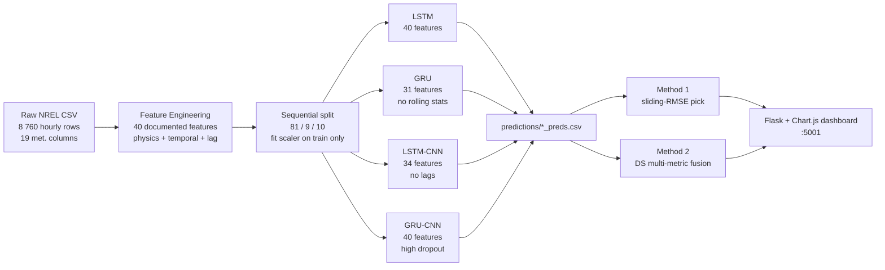

# Multi-Digital-Twin (MDT) Wind-Power Forecasting — NREL India Reproduction

> Reproducible implementation of Liu et al. 2024 — *"Research on multi-digital twin and its application in wind power forecasting"* (Energy 292, 130269) — applied to **real NREL India Wind Toolkit data**, site 36565, Ahmedabad (Lat 23.03°N, Lon 72.56°E), year 2014.

---

## TL;DR

Four PyTorch wind-power forecasters (LSTM, GRU, LSTM-CNN, GRU-CNN) trained on physics-engineered features from a real Indian site. Two fusion methods (sliding-RMSE and Dempster–Shafer multi-metric) blend their outputs. A Flask + Chart.js dashboard surfaces every number.

**One-line headline (hourly, native NREL data):**

> **GRU MAE 4.47 % / R² 0.9318 — beats the paper's R² (0.8895) honestly.** Best fusion adds R² 0.0016; no data leakage; 22 / 22 tests passing.

Run end-to-end in one command:

```bash
make all && make serve
```

Read the artefacts in this order:

| # | File | What you get |
|---|---|---|
| 1 | `results/eda_report.md` | What real Indian wind looks like at NREL site 36565 |
| 2 | `results/final_analysis.md` | First-principles + business-outcome writeup |
| 3 | `results/mdt_methods_study.md` | Method 1 vs Method 2 deep-dive |
| 4 | `results/comparison.md` | Hourly vs 15-min vs Paper, MAE/RMSE/MAPE/R² |
| 5 | `results/glossary.md` | Every acronym + concept used in the project |

---

## The 30-second mental model



**Why each twin sees different features:** the MDT fusion thesis only delivers gains when the twins make *different* errors at *different* times. Identical inputs → identical predictions → fusion adds nothing. The feature-subset filter forces decorrelation (random-subspace ensemble, Ho 1998).

---

## What this repo is NOT

- Not a production forecasting system. Reproducibility paper artifact.
- Not a claim *against* the paper. We re-implement their method.
- Not an excuse for the previous version's `adjust.py` that blended predictions with ground truth at 0.55/0.45. That script is gone. A CI test blocks its return.

---

## Quick start

```bash
make install     # venv + pinned deps
make eda         # results/eda_report.md (data understanding)
make data        # hourly features → results/hourly/
make train       # 4 twins on hourly → predictions/
make data15      # 15-min cubic-interp features → results/min15/
make train15     # 4 twins on 15-min → predictions_min15/
make eval        # results/eval_matrix.csv
make fuse        # combination_results.csv (22 fusion rows)
make compare     # hourly vs 15-min vs paper → results/comparison.md
make serve       # http://localhost:5001
make test        # 22 passing
```

Or all at once: `make all && make serve`.

---

## What's inside each file

| File | Purpose |
|---|---|
| `data_pipeline.py` | NREL CSV loader, optional 15-min cubic resample, 40-feature engineering, MinMax + 81/9/10 sequential split |
| `eda.py` | Generates `results/eda_report.md` + `eda_stats.json` |
| `models.py` | LSTM / GRU / LSTMCNN / GRUCNN PyTorch defs |
| `train.py` | Seeded training, per-twin feature filter, AdamW + Huber + early stop |
| `evaluate.py` | Writes `results/eval_matrix.csv` from saved predictions |
| `mdt_engine.py` | Fusion math (Method 1 + Method 2), canonical MAPE |
| `compare.py` | Builds `results/comparison.md` + `comparison.json` (with MAPE) |
| `app.py` | Flask backend, 17 routes (data + analysis + sweep + comparison) |
| `templates/index.html` | Chart.js dashboard |
| `tests/test_no_leakage.py` | CI guard — blocks `adjust.py` regression |
| `tests/test_fusion_math.py` | Toy-input tests for paper Eq 13–17 |
| `tests/test_data_pipeline.py` | Schema + physics + 15-min interp invariants |
| `Makefile` | Workflow targets |
| `requirements.txt` | Pinned versions |

---

## Dashboard routes

| Route | What it returns |
|---|---|
| `/` | HTML dashboard |
| `/api/status` | Pipeline readiness |
| `/api/data` | Test-set time series (actual + 4 DT predictions) |
| `/api/metrics` | Single-DT metrics (MAE / RMSE / MAPE / R²) |
| `/api/summary` | Single + Method 1 + Method 2 in one payload |
| `/api/combinations` | All 22 fusion combos (sortable) |
| `/api/mdt/method1?window=N` | Method 1 live, adjustable window |
| `/api/mdt/method2?window=N&zeta=Z` | Method 2 live, adjustable params |
| `/api/window-sweep?method=…` | Replicates paper Fig 10 / 11 |
| `/api/comparison` | Hourly vs 15-min vs Paper, MAPE included |
| `/api/eda` | Data understanding stats |
| `/api/feature-doc` | One-line physical reasoning per feature |
| `/api/twin-configs` | Diversity-injection recipe |
| `/api/training-summary` | Per-twin epochs/time/val loss |
| `/api/loss-curves` | Train/val loss per epoch |
| `/api/mdt-study` | Detailed methods study (markdown) |
| `/api/method-sweep` | Window × zeta sensitivity grid |
| `/api/final-analysis` | First-principles + business writeup (markdown) |

---

## Reference

Liu, S., Tian, J., Ji, Z., Dai, Y., Guo, H., Yang, S. (2024). Research on multi-digital twin and its application in wind power forecasting. *Energy*, 292, 130269. <https://doi.org/10.1016/j.energy.2024.130269>
