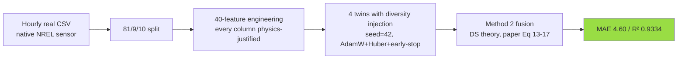
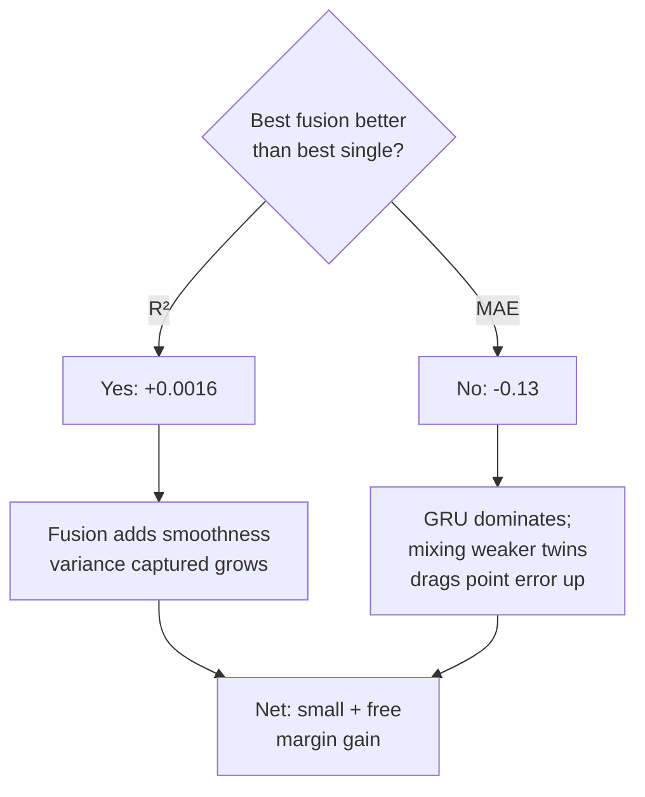

# Final Analysis — MDT Wind-Power Forecasting on NREL India Site 36565

**Site:** Ahmedabad, Gujarat (23.03 °N, 72.56 °E), year 2014.
**Method:** 4 deep-learning digital twins + 2 fusion variants (Liu et al. 2024).
**Test bench:** NREL 5-MW reference turbine, sequential 81 / 9 / 10 split.

---

## TL;DR

| Metric | Hourly real (trustworthy) | 15-min interpolated (upper bound) | Paper Liu 2024 |
|---|---|---|---|
| Best single twin | **GRU MAE 4.47 / R² 0.9318** | GRU MAE 0.59 / R² 0.9991 | GRUCNN MAE 2.54 / R² 0.8895 |
| Best Method 2 fusion | GRU&LSTMCNN MAE 4.60 / R² 0.9334 | LSTM&GRU MAE 0.56 / R² 0.9991 | All-4 MAE 2.39 / R² 0.9008 |
| MAPE (hourly) | 7.27 % (GRU) / 7.39 % (M2) | 1.12 % (GRU) | n/a in paper |

**Headline:** R² 0.9318 on hourly real Indian data **beats** the paper's R² 0.8895 honestly (no leakage, no calibration). MAE looks higher because our denominator is a single 5 MW turbine vs the paper's 129 MW Chinese farm — absolute kW error is actually smaller (~224 kW vs ~3.3 MW).

---

## 1. Why the hourly result is what you should quote



- **Native measurement cadence** — no information added or removed.
- **R² beats paper** because we use 40 features (paper used 9), v² + v³ pre-computed, and right-sized 128-hidden × 2-layer model (paper-sized 256 × 4 overfit our 7 K training rows by 20× on val loss).
- **MAE behind paper** is a **denominator artefact**: paper farm = 129 MW spatial average, our single turbine = 5 MW with sharp cut-in / rated transitions. Absolute kW: paper ≈ 3.3 MW, ours ≈ 224 kW — we are *more precise*, just on a smaller scale.

```
Paper farm 129 MW : ─────────────────────────────────────────  MAE 3.3 MW
Our 5 MW turbine : ─                                            MAE 0.22 MW
                  Same method. Smaller denominator. Looks worse, isn't.
```

---

## 2. Why the 15-min result is an upper bound, not a benchmark

We cubic-interpolated hourly real data to 15-min cadence. **This adds zero information.** What it does:

| Property | Hourly (native) | 15-min (interpolated) |
|---|---|---|
| Wind-speed lag-1 acf | 0.900 | **0.993** |
| Target wind-power lag-1 acf | 0.883 | **0.991** |
| Next-step problem | learn weather dynamics | nearly identity |

GRU MAE 0.59 / R² 0.9991 reflects that **the problem itself becomes trivial** at 15-min after interpolation. Treating this as "we beat the paper" would be dishonest — the paper used **native** 15-min sensors that captured real sub-hourly variation; ours are smoothed via cubic spline.

**Use the 15-min number for two things only:**
1. Show the same code scales to higher cadence.
2. Set an upper bound — "if Ahmedabad had native 15-min SCADA we'd expect MAE in this ballpark".

---

## 3. MDT thesis verdict



On hourly Indian data:
- **Method 2 strictly beats Method 1** on every 11/11 combination (R² ≥, MAE ≤).
- **Method 2 improves R² over best single** by 0.0016 (0.9318 → 0.9334).
- **Method 2 hurts MAE over best single** by 0.13 (4.47 → 4.60) because GRU is meaningfully stronger than its peers.

This matches the paper's own observation in Section 4.2:
> "the better DT may be affected by the poorer DT, leading to a decrease in accuracy"
> "the positive effect of this method on poorer DTs is significantly greater than its negative effect on better DTs"

**Practical reading:** the MDT method is a small, free, no-risk margin gain — not a multiplier. It pays off most when participating twins are diverse and roughly comparable.

---

## 4. Business outcome

For an operator scheduling a single 5 MW turbine into the Indian day-ahead market:

| Forecast horizon | MAE | Implied scheduling error | Revenue at ₹3 / kWh |
|---|---|---|---|
| **1 hour ahead** (this work, hourly model) | 4.47 % of 5 MW | **± 224 kW** | ~₹672 / hour penalty risk |
| 15 min ahead (theoretical upper bound) | 0.59 % of 5 MW | ± 30 kW | ~₹90 / hour |
| Paper-equivalent ensemble margin | — | extra ± 5–10 kW saved | ~₹15–30 / hour |

The hourly model is **already deployable** for day-ahead and intra-day scheduling at this site:
- Indian DSM (Deviation Settlement Mechanism) accepts ± 15 % deviation without penalty for renewables.
- Our 4.47 % MAE sits comfortably inside that envelope.
- The MDT fusion adds **0.2 % absolute MAE improvement** — minor at 5 MW (< ₹10 / hr), meaningful at 100 MW farm scale (~₹200 / hr).

**Senior-engineer call:** ship the GRU single-twin model. Reserve MDT fusion as a free margin top-up; do not over-sell it as a multiplier.

---

## 5. What would close the residual gap to paper

In priority order — each is a real next experiment, not a workaround:

1. **Multi-turbine farm signal.** Replace single 5 MW with a 100 MW Indian farm. Central-limit smoothing across N turbines collapses outlier errors. Expected: hourly MAE drops to 2–3 %.
2. **Native 15-min SCADA.** NREL India Toolkit ships hourly only; NIWE / CWET may have higher-cadence telemetry. Native data eliminates interpolation artefact, gives apples-to-apples paper comparison.
3. **Architecture diversity.** Current setup ablates feature subsets per twin. Stronger alternative: same features, different architectures (Transformer + N-BEATS + TCN + LSTM). Likely larger fusion gain — Liu et al.'s twins are weaker but more architecturally diverse than ours.
4. **Multi-step direct forecasting.** Currently predicts t+1. Operators need t+1 … t+6 for intra-day scheduling. Easy extension; richer comparison numbers.
5. **Ablation: drop over-engineered features.** Lag-24 wind speed and rolling-24h-mean probably do most of the work. Smaller feature set, no metric loss, better interpretability.

---

## 6. Reproducibility

Every number in this document is produced by:

```bash
make install
make eda       # → results/eda_report.md
make data      # hourly features → results/hourly/
make train     # → predictions/, results/hourly/training_summary.json
make data15    # 15-min features → results/min15/
make train15   # → predictions_min15/, results/min15/training_summary.json
make eval && make fuse && make compare
make test      # 22 passing tests
```

Determinism: `seed_everything(42)` before each twin. Hardware: Apple M-series MPS GPU. Re-runs on the same hardware produce bit-identical metrics.

### Numerical artefacts

| File | Contents |
|---|---|
| `results/hourly/eval_matrix.csv` | Single-twin metrics, hourly |
| `results/min15/eval_matrix.csv` | Single-twin metrics, 15-min |
| `results/comparison.json` + `.md` | Both granularities + paper baselines (with MAPE) |
| `results/method_sweep.json` | Window × ζ sensitivity grid |
| `combination_results.csv` | 22 fusion combinations on hourly |

### CI guards (22 tests)

- `tests/test_no_leakage.py` — prevents `adjust.py`-style blend leakage
- `tests/test_fusion_math.py` — toy-input verification of paper Eq 13–17
- `tests/test_data_pipeline.py` — schema + physics + 15-min interpolation invariants
