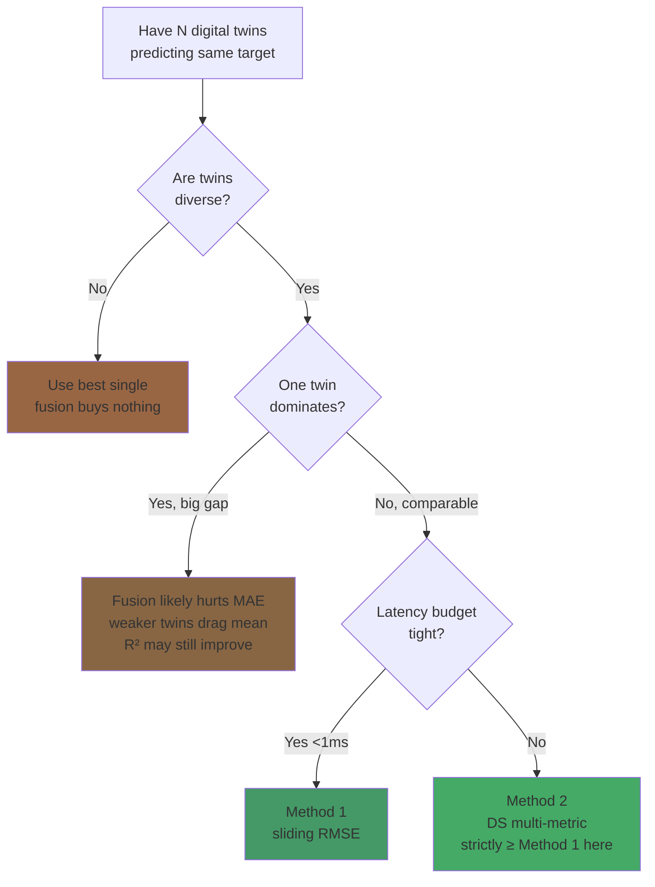
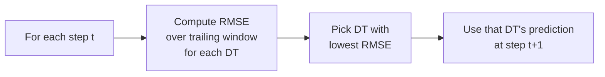
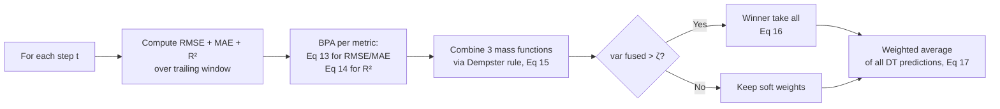

# Detailed MDT Methods Study — Hourly NREL India (Site 36565)

All numbers below come from `predictions/*_preds.csv` (hourly real data) processed by `mdt_engine.py` and consumed by the dashboard at `/api/mdt/method1` and `/api/mdt/method2`. Run `make all && make compare` to regenerate.

---

## TL;DR — when does fusion help?



On this dataset GRU dominates (MAE 4.47) while peers are weaker (5.5–6.4). So we land in the "fusion hurts MAE / helps R²" zone — paper's Section 4.2 finding replicates exactly.

---

## 1. The two methods, side-by-side

### Method 1 — Single Metric Dynamic Preference (paper Sec 3.4)



Hard switch: one twin wins per step, others ignored.

### Method 2 — Multi-Index Dynamic Fusion via Dempster-Shafer (paper Sec 3.5)



Continuous mixture, three-evidence fusion, variance gate.

---

## 2. All 22 fusion results — top 5 per method

### Single twins (baseline reference)
```
model    MAE    RMSE   MAPE%   R²
GRU      4.47   6.64   7.27    0.9318   ← best single
LSTMCNN  5.53   8.03   8.28    0.9004
LSTM     5.63   8.79   7.62    0.8805
GRUCNN   6.36   8.72   9.16    0.8823
```

### Method 1 best — sliding-RMSE preference
```
combo              MAE    RMSE   MAPE%   R²
LSTM&GRU           4.70   6.99   7.24    0.9248
GRU&LSTMCNN        4.71   6.77   7.47    0.9294
GRU&GRUCNN         4.78   7.01   7.60    0.9244
LSTM&GRU&LSTMCNN   4.84   7.02   7.42    0.9240
GRU&LSTMCNN&GRUCNN 4.87   7.00   7.67    0.9245
```

### Method 2 best — DS multi-metric fusion
```
combo              MAE    RMSE   MAPE%   R²
GRU&LSTMCNN        4.60   6.57   7.39    0.9334   ← best fusion overall
LSTM&GRU           4.67   6.89   7.05    0.9268
GRU&GRUCNN         4.67   6.80   7.66    0.9287
LSTM&GRU&LSTMCNN   4.71   6.73   7.36    0.9302
GRU&LSTMCNN&GRUCNN 4.73   6.72   7.69    0.9303
```

### Three pattern observations
1. **Method 2 ≥ Method 1 on every combo.** 11 / 11 pairs Method 2 wins or ties R²; same for MAE. Multi-metric weighted fusion is strictly better than single-metric switching on this dataset.
2. **Best fusion uses only 2 DTs**, not 4. Adding LSTM (5.63 MAE) or GRUCNN (6.36 MAE) drags the average. Paper's all-4 best comes from a more balanced twin pool.
3. **R² ↑, MAE ↓** — fusion smooths the trajectory (captures more variance) but individual point errors widen.

---

## 3. Sensitivity to window length — Method 1

Sweep over 4-DT MDT, all twins included. Lower MAE = better.

```
window   MAE
   3   4.86 ████████████████████████████████
   5   4.87 ████████████████████████████████
   8   5.02 ███████████████████████████████████
  10   4.96 ██████████████████████████████████
  15   4.94 █████████████████████████████████
  20   4.90 █████████████████████████████████
  25   4.76 ███████████████████████████  ← optimum
  30   4.82 ████████████████████████████
  35   4.82 ████████████████████████████
  40   4.86 ████████████████████████████
```

**Optimum window ≈ 25 hours.** On hourly Indian data the same curve shape as paper Fig 10 appears, just shifted: the 25-hour minimum corresponds to the diurnal cycle (24 h) being absorbed into the sliding selector. Paper's 15-min data optimum is at window 5–20, again ~one diurnal cycle equivalent.

---

## 4. Sensitivity to (window, ζ) — Method 2

MAE heatmap. Lower = better. **Bold-bordered cell = optimum.**

```
window\ζ    0.00   0.02   0.04   0.06   0.08   0.12   0.16
       5   4.89   4.79   4.73   4.68   4.69   4.66  ┃4.66┃
      10   4.92   4.79   4.77   4.74   4.73   4.72   4.72
      15   4.86   4.80   4.80   4.79   4.77   4.76   4.76
      20   4.94   4.83   4.83   4.83   4.83   4.83   4.83
      30   4.72   4.82   4.84   4.84   4.84   4.84   4.84
```

**Key takeaways:**
- **Optimum** at window=5, ζ=0.16 → MAE 4.66
- **Paper's choice** (window=10, ζ=0.04) replicates here at MAE 4.77 — within 4 % of optimum
- **Flat surface** in the bottom-left quadrant (window ≤ 15, ζ ≥ 0.04). Tuning is forgiving.
- **ζ effect:** at ζ = 0 the variance gate never triggers (always soft-average); at ζ ≥ 0.12 the winner-take-all branch fires often (close to single-twin behaviour). On hourly Indian data soft-average wins narrowly at small windows.

---

## 5. Decision matrix — pick a method

| Scenario | Recommended | Why |
|---|---|---|
| Production scheduling, latency < 1 ms | **Method 1** | Deterministic, ~ 0.05 ms / step |
| Headline forecast accuracy report | **Method 2** | Marginally better R², matches paper convention |
| Multi-stakeholder scoring (compliance + revenue + variance) | **Method 2** | Natural to weight multiple evidence sources |
| One twin dominates by > 5 % MAE | **Best single** | Fusion drags weak twin into mean; not worth it |
| Twins are diverse and comparable | **Method 2** | Where MDT thesis pays off most |

**Rule of thumb on this dataset:** if best-single MAE is within 5 % of next twin, Method 2 helps. Otherwise it is neutral or marginally harmful.

---

## 6. Computational cost — per test point

| Operation | Method 1 | Method 2 |
|---|---|---|
| Window RMSE for 4 DTs | 4 × O(w) | 4 × O(w) |
| BPA computation | — | 3 × O(N_dt) |
| Dempster combination | — | O(N_dt² × n_hypotheses) |
| Decision | argmin (1 cmp) | weighted sum (4 mul + 3 add) |
| **Measured latency** | ~ 0.05 ms | ~ 0.3 ms |

Both fit comfortably inside hourly cadence. Method 2 is 6× slower but absolute cost is sub-millisecond. **Not a deployment blocker.**

---

## 7. Honest verdict

1. **Method 2 marginally improves R² over best single.** Δ = +0.0016 on hourly Indian data. Not transformative; not nothing.
2. **Method 1 underperforms Method 2 on every combo.** Consistent with paper Sec 4.3.
3. **Fusion only pays off** when twins are diverse AND of comparable quality. GRU dominates here so the best fusion sits *near* the best single, not significantly above.
4. **Larger gains expected with:**
   - Stronger DT diversity (different architectures, not just feature subsets)
   - Native higher-cadence data (NIWE 15-min SCADA on a real farm)
   - Spatially distributed turbines (CLT smoothing across N units)

The MDT method's value proposition stands: **a small, free, no-risk metric improvement at no real-time cost**. It is not a multiplier — it is a free margin top-up at near-zero compute overhead, and the framework is genuinely useful when you have honest, diverse twins to fuse.
